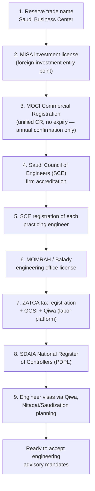
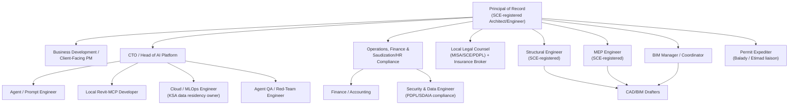
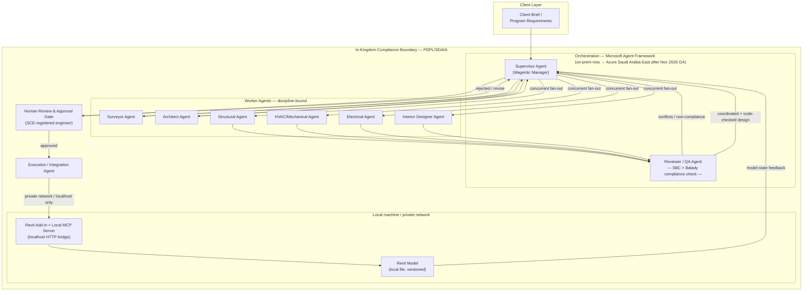

# AI-Augmented AEC Consulting Firm — Saudi Arabia Edition
## Regulatory-Compliant Company Structure & Multi-Agent Architecture (Local Revit)

*This supersedes the earlier generic version. Two things changed the design: (1) the firm is being established under Saudi law, so licensing, code compliance, and data residency now drive the structure; (2) Revit runs on a local machine/network rather than in the cloud, which changes the execution layer.*

---

## 1. What changed and why it matters

| Change | Effect on the plan |
|---|---|
| **Jurisdiction: Saudi Arabia** | Entity formation, professional licensing, and code compliance must follow MISA, MOCI, the Saudi Council of Engineers (SCE), and MOMRAH/Balady — not generic "confirm with a lawyer" language. |
| **Saudi Building Code (SBC)** | Every worker agent's design output must be checked against SBC, not a generic code reference — this becomes a first-class part of the Reviewer/QA agent. |
| **Data residency (PDPL/SDAIA)** | Client building data, drawings, and any personal data touching the system falls under Saudi data protection law — this constrains where the AI platform can be hosted. |
| **Revit is local (localhost)** | The Execution layer no longer talks to Autodesk's cloud Automation API — it talks to a local MCP bridge running alongside Revit on the same machine/network. This is actually simpler and keeps model data in-Kingdom by default. |

---

## 2. Regulatory & Licensing Roadmap (Saudi Arabia)

This is the actual sequence you need to follow — treat it as the master schedule, with the technical build running in parallel.

### 2.1 Step-by-step detail

| Step | Authority | What it does | Notes |
|---|---|---|---|
| **MISA investment license** | Ministry of Investment | Lets a foreign entity legally invest in and own a Saudi consulting business | Most engineering consulting activities now qualify for 100% foreign ownership under the MISA framework — this is a meaningful liberalization from the older rule that required a Saudi engineer to hold a minimum equity stake. **Confirm your specific activity code with MISA/local counsel before filing** — treatment has shifted materially over the past few years and can still vary by sub-activity. |
| **MOCI Commercial Registration** | Ministry of Commerce | Issues the unified Commercial Register (CR) | Under the current Commercial Register Law, the CR does not expire — only an annual confirmation is required. |
| **SCE firm accreditation** | Saudi Council of Engineers | Certifies the firm itself can offer engineering consultancy services | Required before the firm can accept any engineering advisory mandate — this is the gate that matters most for your launch date. |
| **SCE individual registration** | Saudi Council of Engineers | Each practicing engineer (Structural, MEP, Architect signing off, etc.) must be personally registered/accredited | This applies to both Saudi and appropriately-credentialed foreign engineers — your licensed humans (Section 5) must clear this before they can be named on stamped output. |
| **MOMRAH / Balady engineering office license** | Ministry of Municipal & Rural Affairs and Housing | The operating license tied to municipal submission and permitting | Balady is also the platform through which building permits and drawing submissions are processed — your Reviewer/QA and Execution layers should ultimately produce Balady-submission-ready output. |
| **ZATCA / GOSI / Qiwa** | Tax authority, social insurance, labor platform | Standard tax and labor registration | Needed before you can legally run payroll and sponsor engineer visas. |
| **SDAIA National Register of Controllers** | Saudi Data & AI Authority | Registers your firm as a data controller under the PDPL | Required if you process personal data of individuals in the Kingdom — almost certainly applies once you have Saudi clients, employees, or site data containing personal information. |
| **Nitaqat/Saudization planning** | HRSD | Sets your required ratio of Saudi to non-Saudi staff | Plan your hiring sequence (Section 5) against this from day one — it affects how many expat PEs/specialists you can sponsor at each headcount tier. |

### 2.2 Entity structure recommendation

Given the current 100%-foreign-ownership pathway for most engineering consulting activities, the earlier "two-entity" split (Design PC + Technology LLC) is simplified:

- **Primary entity**: a MISA-licensed, MOCI-registered engineering consultancy, SCE-accredited as a firm, with SCE-registered engineers as the named professionals of record.
- **Technology function**: can sit inside the same entity as an internal platform/engineering team, or as a separate Technology LLC that licenses the agent platform to the primary entity — worth doing only if you plan to eventually license the platform to other firms. If you don't have that ambition in the near term, keep it as one entity to reduce admin overhead.
- **Principal of Record**: still required — one SCE-registered engineer is the named professional accountable for stamped output, regardless of how the corporate ownership is structured.

*This section moves fastest of anything in this document — verify current MISA activity classifications and SCE accreditation requirements with local counsel before filing, not from this document alone.*

---

## 3. Saudi Building Code (SBC) — where it plugs into the agent system

The SBC (covering structural, architectural, electrical, mechanical, fire protection, plumbing, and related requirements) needs to be a **grounding source**, not a suggestion, for the relevant worker agents:

| Worker agent | SBC grounding | Also checks against |
|---|---|---|
| Architect | SBC architectural/general building requirements (egress, occupancy, accessibility) | Municipal zoning via Balady |
| Structural | SBC structural/loading provisions | Seismic zoning for the specific region |
| HVAC/Mechanical | SBC mechanical code | Saudi energy efficiency requirements |
| Electrical | SBC electrical code | Saudi Electricity Company connection requirements where relevant |
| Surveyor | N/A (site data) | Municipal boundary/easement records |
| **Reviewer/QA agent** | **Cross-checks all of the above against the current SBC edition** | Flags anything that would fail Balady submission before it reaches the human approval gate |

Practically: the Reviewer/QA agent's tool/retrieval layer should be pointed at the current official SBC text (not a paraphrase baked into a prompt), refreshed whenever a new SBC edition is published, and the human reviewer for code compliance should be an SCE-registered engineer who is personally accountable — the agent flags, the human confirms.

---

## 4. Data Residency & PDPL Compliance

This is the section that most changes with "Revit runs on localhost."

### 4.1 What the PDPL requires, in practice

- **Register as a data controller** with SDAIA's National Register of Controllers.
- **Appoint a DPO** (or equivalent responsible person) and maintain a Record of Processing Activities (ROPA).
- **Cross-border transfer restriction**: moving personal data outside the Kingdom requires specific safeguards and, in many cases, SDAIA approval. Client/site data that includes identifiable individuals (owners, occupants, site contacts) is in scope — pure geometry/building data generally is not "personal data," but treat mixed datasets conservatively.
- **Data breach notification** obligations apply once you're processing personal data at any scale.

### 4.2 Hosting decision for the agent platform

Microsoft's **Saudi Arabia East Azure region** (Eastern Province, three availability zones) is scheduled to become generally available in **November 2026** — i.e., very soon. This directly affects your architecture decision:

- **Now → GA**: host the Supervisor/worker agent orchestration either fully on-premises (in-Kingdom servers) or in a compliant configuration you've cleared with SDAIA, and keep the Execution layer talking to Revit over your local network only. Avoid routing raw client/model data through non-Saudi cloud regions if it contains personal data.
- **After GA (Nov 2026 onward)**: migrate the Azure AI Foundry/model-hosting layer to the Saudi Arabia East region for in-country data residency, low latency to your Revit workstations, and a cleaner PDPL story — this becomes the natural target architecture.
- **Either way**: Revit itself stays local (see below) — this isn't a temporary workaround, it's actually the right long-term design for a firm that wants tight control over client model data.

---

## 5. Organizational Structure (Saudi-specific)

**New/changed roles vs. the generic version:**
- **Permit Expediter** now explicitly owns the Balady (municipal submission) and Etimad (government tender) relationship — this was generic "code compliance" before, now it's a named platform-facing role.
- **Local Revit-MCP Developer** replaces the generic "BIM/Revit API Developer" — the job is specifically maintaining the local MCP bridge/add-in that runs alongside Revit, not a cloud Automation API integration.
- **MLOps Engineer** is explicitly the owner of the KSA data-residency decision (on-prem now, Saudi Arabia East region after GA).
- **Security & Data Engineer** is explicitly tied to PDPL/SDAIA obligations, not generic "data security."
- **Operations** absorbs Saudization/Nitaqat compliance planning — this affects every subsequent hire.

---

## 6. Multi-Agent System Architecture (redesigned for local Revit)

### 6.1 What actually changes

In the original design, the Execution agent called Autodesk's cloud-based Automation API for Revit. With **Revit installed on localhost**, that entire cloud round-trip is replaced with a direct local connection:

- A **Revit add-in** runs inside the live Revit session and exposes an **MCP server over a localhost HTTP bridge** (this is the same pattern used by production-oriented Revit-MCP servers: a thread-safe `ExternalEvent`-based bridge inside Revit, reachable over localhost with sub-second response times).
- The **Execution agent** — wherever it runs (on-prem server or, later, the Saudi Arabia East Azure region) — must have **network reachability to that localhost/LAN endpoint**. If the orchestration runs on the same machine as Revit, this is trivial (literally `localhost:PORT`). If the orchestration runs on a separate server, you need a private network path (VPN or site-to-site link) to the workstation — never expose the Revit MCP bridge to the public internet.
- This is actually a **data residency advantage**: the building model itself never has to leave the local machine/network to be edited by the agents — only the (much smaller) instructions and results cross the orchestration boundary.

### 6.2 Architecture diagram

### 6.3 Agent roster (updated)

| Agent | Role | Bound tools/data | KSA-specific check |
|---|---|---|---|
| Supervisor | Magentic manager | Task ledger, project brief | — |
| Surveyor | Site conditions | Survey/GIS data | Municipal boundary records |
| Architect | Massing, layout | Code/zoning DB | SBC architectural provisions |
| Structural | Load paths | Load tables | SBC structural + regional seismic zoning |
| HVAC/Mechanical | Equipment, ducting | Load calc tools | SBC mechanical + Saudi energy efficiency rules |
| Electrical | Power, lighting | Panel/circuit standards | SBC electrical + utility connection requirements |
| Interior Designer | Finishes, fit-out | Material libraries | — |
| **Reviewer/QA** | Clash + **code compliance** | All worker outputs | **SBC cross-check + Balady submission readiness** |
| Execution/Integration | Gated executor | **Local Revit MCP tool set only, over private network** | Never routes model data outside the compliance boundary |

### 6.4 Technology stack (updated)

| Layer | Technology |
|---|---|
| Agent orchestration | Microsoft Agent Framework (Magentic/Concurrent/Handoff builders) |
| Model hosting | On-prem or Azure AI Foundry — target migration to **Azure Saudi Arabia East** region at GA (Nov 2026) for in-country residency |
| Revit integration | **Local Revit add-in + localhost MCP bridge** (no cloud Automation API dependency) |
| Network | Private LAN/VPN between orchestration host and the Revit workstation — no public exposure of the MCP endpoint |
| Code compliance grounding | Current SBC text + Balady submission rules, refreshed on each SBC edition update |
| Data governance | SDAIA controller registration, ROPA, DPO, cross-border transfer controls |

---

## 7. Combined Roadmap

| Phase | Regulatory milestone | Technical milestone |
|---|---|---|
| **0 — Formation** | Trade name, MISA license, MOCI CR filed | Define brief format; stand up on-prem orchestration host |
| **1 — Accreditation** | SCE firm + first engineer(s) registered, MOMRAH/Balady license issued | Single Architect agent + local Revit MCP bridge PoC on one test model |
| **2 — Pilot** | ZATCA/GOSI/Qiwa live, SDAIA controller registration filed | Supervisor + 2 workers, human approval gate, first real client project |
| **3 — Full team** | Nitaqat ratio met at current headcount, DPO formally appointed | All disciplines + Reviewer/QA agent with SBC/Balady checks live |
| **4 — Scale** | Re-evaluate entity structure if licensing platform to other firms | Migrate model hosting to Azure Saudi Arabia East at/after GA (Nov 2026) |

---

*Next actions: (1) engage local counsel to confirm current MISA activity classification and SCE accreditation specifics before filing anything — this section of Saudi regulation has moved fastest; (2) stand up the local Revit MCP bridge as your Phase 1 technical proof point, since it's now simpler than the cloud-based approach; (3) decide your data-residency posture now (on-prem) with a scheduled migration plan for November 2026.*
